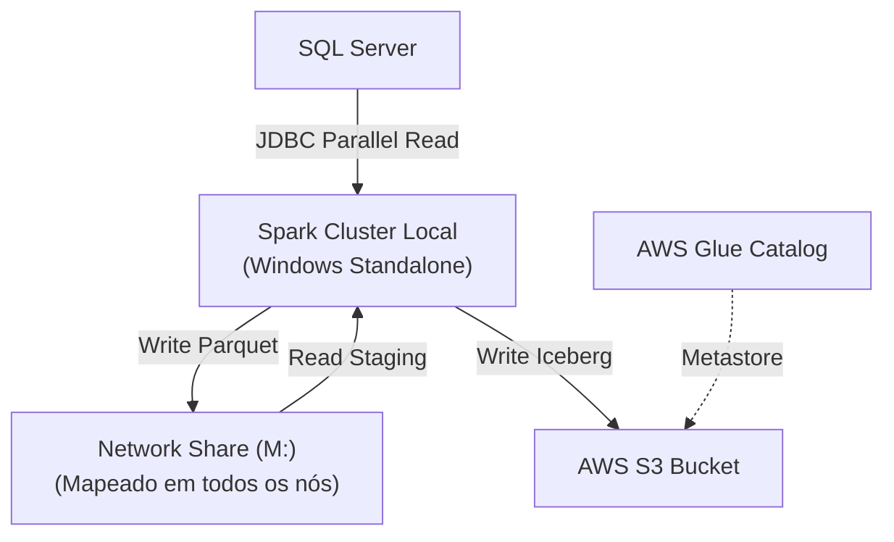

# Local Data Lakehouse: Spark (Windows), SQL Server & AWS Iceberg

Este projeto documenta e implementa um pipeline de dados distribuído (ETL) executado em um **cluster local Apache Spark (Standalone)** no Windows. O objetivo é demonstrar a extração paralela de alto desempenho do SQL Server e a carga em tabelas **Apache Iceberg** no Amazon S3, catalogadas via AWS Glue.


Este repositório contém recursos auxiliares (como a pasta `hadoop` com `winutils.exe`) necessários para o ambiente Windows.

## 🏗 Arquitetura

O fluxo de dados utiliza um **Drive de Rede Mapeado (M:)** para garantir que todos os nós (Master e Workers) acessem os arquivos de *staging* intermediários.



## 📋 Pré-requisitos Críticos

Para reproduzir este laboratório, seu ambiente deve atender estritamente aos requisitos abaixo.

### 1. Ambiente de Software

* **Sistema Operacional:** Windows 10 ou 11.
* **Apache Spark:** Versão 3.5.7 (Binários do Cluster).
* **Python:** **Versão 3.11** (Obrigatório).
> ⚠️ **Crítico:** Não use Python 3.12 ou superior. O Apache Spark 3.5 possui incompatibilidades conhecidas (erros de `daemon` e `worker`) com versões recentes do Python.

### 2. Configuração do Python (Driver Local)

Você precisa instalar as bibliotecas no computador que executará o script `extract_load_jdbc.py`.

1. Abra o terminal (CMD ou PowerShell).
2. Garanta que o comando `python` aponte para a versão 3.11:
```powershell
python --version
# Deve retornar Python 3.11.x

```

3. Instale o **PySpark** via pip. É fundamental que a versão do `pip` seja da mesma família (Major.Minor) do cluster (3.5.x):
```powershell
pip install pyspark==3.5.7

```

*(Nota: Se houver outras dependências como `pandas` ou `boto3` para scripts auxiliares, instale-as aqui também).*

### 3. Infraestrutura de Rede (Obrigatório)

Como este é um cluster distribuído, a comunicação e o armazenamento devem ser compartilhados:

1. **Pasta Compartilhada (Drive M:):**
* A pasta `lake_house` deve estar em uma máquina acessível pela rede.
* **Importante:** Em **todas** as máquinas (Master e Workers), você deve mapear essa pasta de rede para a letra **`M:`**.
* O Hadoop no Windows funciona melhor com letras de unidade do que com caminhos UNC (`\\servidor\pasta`).
* Caminho final esperado: `M:\lake_house`.

2. **Firewall do Windows:**
* Talvez seja necessário liberar as portas usadas pelo Spark no Firewall de **todas** as máquinas, ou desativá-lo temporariamente para testes na rede privada.
* **Portas Principais:** 7077 (Master), 8080 (Master UI), 8081 (Worker UI), 4040 (Driver UI), 18080 (History Server) e portas de BlockManager (definidas como 10020-10022 na config).

## ⚙️ Configuração de Variáveis de Ambiente

Configure estas variáveis nas "Variáveis de Ambiente do Sistema" em **todas** as máquinas do cluster.

| Variável | Valor (Exemplo) | Descrição |
| --- | --- | --- |
| `HADOOP_HOME` | `C:\hadoop\hadoop-3.3.6` | Pasta contendo `bin\winutils.exe`. |
| `SPARK_HOME` | `C:\spark\spark-3.5.7-bin-hadoop3` | Instalação do Spark. |
| `PYSPARK_PYTHON` | `C:\Python311\python.exe` | **Crucial:** Caminho exato do Python 3.11 em todas as máquinas. |
| `PYSPARK_DRIVER_PYTHON` | `python` | - |
| `AWS_ACCESS_KEY_ID` | `SUA_KEY` | Credencial AWS. |
| `AWS_SECRET_ACCESS_KEY` | `SUA_SECRET` | Credencial AWS. |
| `AWS_DEFAULT_REGION` | `us-east-1` | Região AWS. |

> Adicione `%HADOOP_HOME%\bin` e `%SPARK_HOME%\bin` à variável **PATH**.

## 🛠️ Instalação e Configuração

### 1. Autenticação SQL Server (DLL)

Para usar a **Autenticação Integrada do Windows** (`integratedSecurity=true`):

1. Vá até: `sqljdbc_13.2\ptb\auth\x64` (neste repositório).
2. Copie o arquivo **`mssql-jdbc_auth.dll`**.
3. Cole em **`C:\Windows\System32`** (em todas as máquinas que executarão o Driver/Executor).

### 2. Configuração do `spark-defaults.conf`

Cada máquina (Master e Workers) deve ter seu arquivo configurado. A diferença principal é o endereçamento IP.

**Caminho:** `%SPARK_HOME%\conf\spark-defaults.conf`

#### A. Configuração do MASTER (Ex: IP 192.168.59.62)

```properties
# --- Performance e Serialização ---
spark.serializer                     org.apache.spark.serializer.KryoSerializer
spark.kryoserializer.buffer.max      512m
spark.sql.adaptive.enabled           true
spark.sql.adaptive.coalescePartitions.enabled true
spark.sql.shuffle.partitions         500

# --- Recursos ---
spark.executor.instances             2
spark.executor.cores                 4
spark.executor.memory                5g
spark.driver.memory                  2g
spark.memory.fraction                0.8

# --- Rede (MASTER) ---
# Atenção: O spark.master aponta para si mesmo
spark.master                         spark://192.168.59.62:7077
spark.driver.host                    192.168.59.62
spark.driver.bindAddress             0.0.0.0

spark.master.port                    7077
spark.master.webui.port              8080
spark.worker.ui.port                 8081
spark.blockManager.port              10020
spark.driver.blockManager.port       10021
spark.driver.port                    10022
spark.network.timeout                800s
spark.executor.heartbeatInterval     60s

# --- Pacotes (Iceberg, AWS, Hadoop, MSSQL) ---
spark.jars.packages                  org.apache.iceberg:iceberg-spark-runtime-3.5_2.12:1.10.0,org.apache.iceberg:iceberg-aws-bundle:1.10.0,org.apache.hadoop:hadoop-aws:3.3.4,org.apache.hadoop:hadoop-common:3.3.4,com.amazonaws:aws-java-sdk-bundle:1.12.764,com.microsoft.sqlserver:mssql-jdbc:13.2.1.jre11

# --- Configuração Iceberg/Glue e S3 ---
spark.sql.defaultCatalog             dev
spark.sql.catalog.dev                org.apache.iceberg.spark.SparkCatalog
spark.sql.catalog.dev.type           glue
spark.sql.catalog.dev.warehouse      s3://data-warehouse/tables/
spark.sql.catalog.dev.io-impl        org.apache.iceberg.aws.s3.S3FileIO
spark.sql.catalog.dev.s3.cross-region-access-enabled true
spark.sql.catalog.dev.glue.skip-name-validation      true
spark.sql.extensions                 org.apache.iceberg.spark.extensions.IcebergSparkSessionExtensions

spark.hadoop.fs.s3.impl              org.apache.hadoop.fs.s3a.S3AFileSystem
spark.hadoop.fs.s3a.impl             org.apache.hadoop.fs.s3a.S3AFileSystem
spark.hadoop.fs.s3a.fast.upload      true
spark.sql.parquet.int96RebaseModeInWrite CORRECTED

# --- Logs ---
spark.eventLog.enabled               true
spark.eventLog.dir                   file:///C:/spark/spark-3.5.7-bin-hadoop3/spark-events
spark.history.fs.logDirectory        file:///C:/spark/spark-3.5.7-bin-hadoop3/spark-events
spark.history.ui.port                18080

```

#### B. Configuração dos WORKERS (Ex: IP 192.168.59.63)

No arquivo `spark-defaults.conf` da máquina Worker, você deve alterar as configurações de rede para refletir o IP daquela máquina específica, mas **mantendo o apontamento para o Master**.

```properties
# --- Rede (WORKER) ---
# Aponta para o IP do Master
spark.master                         spark://192.168.59.62:7077 

# Aponta para o IP DESTA máquina (Worker)
spark.driver.host                    192.168.59.63
spark.driver.bindAddress             0.0.0.0

# Demais configurações (Pacotes, Iceberg, Logs) devem ser IDÊNTICAS ao Master
# ... copie o restante do arquivo do Master ...

```

---

## 🚀 Execução do Pipeline

### 1. Iniciar o Cluster

Abra terminais (como Administrador se necessário para portas):

**No PC Master:**

```powershell
spark-class org.apache.spark.deploy.master.Master
# Em outro terminal (se o Master também for Worker)
spark-class org.apache.spark.deploy.worker.Worker spark://192.168.59.62:7077

```

**Nos PCs Workers:**

```powershell
spark-class org.apache.spark.deploy.worker.Worker spark://192.168.59.62:7077

```

### 2. Verificar Conectividade

Acesse `http://192.168.59.62:8080` (IP do Master). Você deve ver todos os Workers listados como **ALIVE**. Se não estiverem, verifique o Firewall e se o drive `M:` está acessível.

### 3. Executar o Job Python

```bash
python extract_load_jdbc.py

```

## 🐍 Código da Aplicação (`extract_load_jdbc.py`)

O código abaixo realiza a orquestração do pipeline. Note que a variável `LOCAL_FILES` aponta para `M:/lake_house`, garantindo que qualquer Worker possa escrever e ler os dados.

```python
from datetime import datetime, timedelta
from dataclasses import dataclass
import uuid
import re
import shutil
from pyspark.sql import SparkSession

# IMPORTANTE: Caminho mapeado na rede acessível por todos os Workers
LOCAL_FILES = "M:/lake_house"

@dataclass
class SparkTable:
    server: str
    database: str
    schema_table: str
    table_name: str
    primary_key: str
    conds: str = None

    @property
    def full_name(self) -> str:
        return f"{self.database}.{self.schema_table}.{self.table_name}"

    @property
    def full_name_athena(self) -> str:
        return f"{self.database.lower()}_{self.schema_table.lower()}_{self.table_name.lower()}"

@dataclass
class URLMssql:
    table: SparkTable
    driver: str = "com.microsoft.sqlserver.jdbc.SQLServerDriver"
    isolation_level: str = "READ_UNCOMMITTED"
    prefer_timestamp_ntz: bool = True

    @property
    def full_url(self) -> str:
        return (
            f"jdbc:sqlserver://{self.table.server}:1433;"
            f"databaseName={self.table.database};"
            "encrypt=true;integratedSecurity=true;trustServerCertificate=true;"
        )

    @property
    def options(self) -> dict[str, str]:
        return {
            "url": self.full_url,
            "driver": self.driver,
            "isolationLevel": self.isolation_level,
            "preferTimestampNTZ": self.prefer_timestamp_ntz,
        }

def parse_date_expressions(query_string: str | None) -> str | None:
    """Interpreta placeholders de data ({hoje}, {ontem}) na query."""
    if not query_string:
        return query_string

    hoje = datetime.now()
    bases = {
        "hoje": hoje,
        "ontem": hoje - timedelta(days=1),
        "inicio_mes": hoje.replace(day=1),
        "inicio_ano": hoje.replace(month=1, day=1),
    }

    def replace_match(match: re.Match):
        base_name = match.group(1)
        operator = match.group(2)
        amount = match.group(3)

        target_date = bases.get(base_name)
        if not target_date:
            return match.group(0)

        if not operator:
            return target_date.strftime("%Y-%m-%d")

        days = int(amount)
        if operator == "-":
            new_date = target_date - timedelta(days=days)
        elif operator == "+":
            new_date = target_date + timedelta(days=days)

        return new_date.strftime("%Y-%m-%d")

    pattern = r"\{(hoje|ontem|inicio_mes|inicio_ano)(?:([\+\-])(\d+)d)?\}"
    return re.sub(pattern, replace_match, query_string)

def lower_upper_bound(spark: SparkSession, table: SparkTable) -> tuple:
    """Busca limites da PK para particionamento JDBC."""
    url = URLMssql(table)
    stmt = f"""
    select 
        min({table.primary_key}) as min_lower, 
        max({table.primary_key}) as max_upper
    from {table.full_name} with(nolock)
    {f"where {table.conds}" if table.conds else ""}
    """
    options = url.options
    options |= {"query": stmt}
    start, end = spark.read.format("jdbc").options(**options).load().collect()[0]
    return start, end

def write_parquet(spark: SparkSession, table: SparkTable, cores: int = 8) -> str:
    """Salva dados do SQL Server na pasta de rede M:/lake_house."""
    start, end = lower_upper_bound(spark, table)
    url = URLMssql(table)

    if isinstance(start, datetime):
        start, end = f"{start:%Y-%m-%d %H:%M:%S}", f"{end:%Y-%m-%d %H:%M:%S}"

    options = url.options
    options |= {
        "dbtable": f"(select * from {table.full_name} with(nolock) {f'where {table.conds}' if table.conds else ''}) as tabela",
        "partitionColumn": table.primary_key,
        "numPartitions": cores,
        "fetchsize": 100_000,
        "lowerBound": f"{start}",
        "upperBound": f"{end}",
    }

    df = spark.read.format("jdbc").options(**options).load()
    rename_cols = {c: c.lower() for c in df.columns}

    df.withColumnsRenamed(rename_cols).write.parquet(
        f"{LOCAL_FILES}/{table.full_name_athena}/{table.full_name_athena}_{uuid.uuid4()}",
        compression="zstd",
        mode="overwrite",
    )
    return table

def overwrite_table_iceberg(spark: SparkSession, table: SparkTable, schema: str = "spark_load") -> SparkTable:
    """Lê da pasta de rede e escreve na AWS (Iceberg/S3)."""
    # Importante: Lê de M:/... onde os workers salvaram os arquivos
    df = spark.read.parquet(f"{LOCAL_FILES}/{table.full_name_athena}/{table.full_name_athena}_*")
    (
        df.coalesce(24)
        .writeTo(f"{schema}.{table.full_name_athena}")
        .tableProperty("write.format.default", "parquet")
        .tableProperty("write.parquet.compression-codec", "zstd")
        .tableProperty("write.parquet.compression-level", "3")
        .tableProperty("write.distribution-mode", "none")
        .tableProperty("write.object-storage.enabled", "true")
        .tableProperty("write.target-file-size-bytes", "134217728")
        .tableProperty("write.delete.mode", "merge-on-read")
        .tableProperty("write.update.mode", "merge-on-read")
        .tableProperty("write.merge.mode", "merge-on-read")
        .createOrReplace()
    )
    return table

def optimize_table(spark: SparkSession, table: SparkTable, schema: str = "spark_load") -> SparkTable:
    """Executa manutenção na tabela Iceberg."""
    print(" => rewrite_data_files")
    table_name = f"{schema}.{table.full_name_athena}"
    spark.sql(f"""
        CALL system.rewrite_data_files(
            table => '{table_name}',
            options => map('partial-progress.enabled', 'true', 'rewrite-all', 'true')
        )
    """)
    
    print(" => expire_snapshots")
    dt_expire = datetime.now() - timedelta(minutes=1)
    spark.sql(f"""
        CALL system.expire_snapshots(
            table => '{table_name}',
            older_than => TIMESTAMP '{dt_expire:%Y-%m-%d %H:%M:%S}',
            retain_last => 1
        )
    """)
    
    print(" => remove_orphan_files")
    spark.sql(f"""
        CALL system.remove_orphan_files(
            table => '{table_name}',
            dry_run => false
        )
    """)
    return table

def iter_lower_upper_bound(spark: SparkSession, table: SparkTable, chunk: int = 100) -> list[tuple]:
    """Itera em lotes para grandes volumes de dados."""
    url = URLMssql(table)
    stmt = f"""
    select distinct {table.primary_key} as chave
    from {table.full_name} with(nolock)
    {f"where {table.conds}" if table.conds else ""}
    """
    options = url.options
    options |= {"query": stmt}
    rows = spark.read.format("jdbc").options(**options).load().collect()
    rows_sorted = sorted([row.chave for row in rows])
    lista_batch = []
    for idx in range(0, len(rows_sorted), chunk):
        lotes = rows_sorted[idx : idx + chunk]
        lista_batch.append((lotes[0], lotes[-1]))
    return lista_batch

def main_spark_jdbc(
    server: str,
    database: str,
    schema_table: str,
    table_name: str,
    primary_key: str,
    conds: str | None = None,
    chunk: int = 100,
    cores: int = 8,
    optimize: bool = False,
    iter_lower: bool = True,
    create_table: bool = True,
    drop_table: bool = False,
) -> None:
    try:
        spark: SparkSession = SparkSession.builder.appName("job_jdbc").getOrCreate()
        conds = parse_date_expressions(conds)
        tbl = SparkTable(server, database, schema_table, table_name, primary_key, conds)

        if iter_lower:
            rows = iter_lower_upper_bound(spark, tbl, chunk=chunk)
            where = f"and ({conds})" if conds else ""
            for start, end in rows:
                tbl.conds = f"{tbl.primary_key} between {start} and {end} {where}"
                print(tbl.conds)
                print("1 - WRITE PARQUET")
                write_parquet(spark, tbl, cores)
        else:
            write_parquet(spark, tbl, cores)

        if create_table:
            print("2 - OVERWRITE TABLE ICEBERG")
            overwrite_table_iceberg(spark, tbl)

        if optimize and not drop_table:
            print("5 - OPTIMIZE TABLE")
            optimize_table(spark, tbl)
    except Exception as e:
        print(e)
        raise
    finally:
        shutil.rmtree(f"{LOCAL_FILES}/{tbl.full_name_athena}", ignore_errors=True)
        spark.stop()

```

## 🐍 Detalhes da Implementação Python (`extract_load_jdbc.py`)

O script foi desenhado para ser **modular**. Abaixo, a explicação detalhada de cada componente lógico.

### 1. Modelagem de Dados (`dataclasses`)

Utilizamos `dataclasses` para padronizar a configuração das tabelas e evitar a concatenação manual de strings propensa a erros.

* **`SparkTable`:** Centraliza os metadados da tabela (servidor, banco, schema).
* *Destaque:* A propriedade `full_name_athena` converte automaticamente a nomenclatura do SQL Server (ex: `DB.Schema.Table`) para o padrão "flat" aceito pelo AWS Glue/Athena (ex: `db_schema_table`), resolvendo conflitos de caracteres.


* **`URLMssql`:** Encapsula a complexidade da string de conexão JDBC.
* *Destaque:* Garante que `integratedSecurity=true` e `trustServerCertificate=true` sejam sempre injetados, permitindo que a autenticação via Windows (DLL) funcione sem expor senhas no código.

### 2. Tratamento Dinâmico de Datas (`parse_date_expressions`)

Permite definir janelas de carga dinâmicas sem alterar o código.

* **Como funciona:** O script aceita *placeholders* na string de condição SQL.
* **Exemplo:** Se a condição for `data_venda >= '{hoje-3d}'`, e o script rodar dia 15/01, ele traduzirá automaticamente para `data_venda >= '202X-01-12'`.
* **Benefício:** Facilita o agendamento diário (Cron/Airflow) para cargas incrementais (D-1).

### 3. Estratégia de Leitura Paralela (Otimização JDBC)

O Spark, por padrão, lê tabelas JDBC usando uma única thread (um único executor), o que é extremamente lento para grandes volumes. Implementamos duas estratégias para forçar o paralelismo:

* **`lower_upper_bound(spark, table)`:**
* Faz uma consulta leve (`SELECT MIN(id), MAX(id)`) no SQL Server antes da extração.
* Esses valores alimentam os parâmetros `lowerBound` e `upperBound` do Spark. Isso permite que o Spark "fatie" a tabela em N pedaços (baseado no `numPartitions`) e use todos os Workers simultaneamente para baixar os dados.

* **`iter_lower_upper_bound(spark, table)`:**
* *Uso:* Para tabelas massivas onde um único `lower/upper` ainda sobrecarregaria a memória.
* *Lógica:* Quebra os IDs em lotes (chunks) menores e processa a extração em loop. Isso evita estouro de memória (OOM) no Driver e nos Executors.

### 4. Camada de Staging (`write_parquet`)

Antes de enviar para a nuvem, os dados são materializados em disco.

* **Destino:** Pasta de rede mapeada (`M:\lake_house`).
* **Formato:** Parquet com compressão **ZSTD**.
* **Por que isso é necessário?**
1. Libera a conexão com o banco de produção (SQL Server) o mais rápido possível.
2. O upload para o S3 (etapa seguinte) é feito a partir de arquivos Parquet otimizados, e não de uma conexão de banco aberta, o que é mais seguro e estável.

### 5. Carga no Data Lake (`overwrite_table_iceberg`)

Lê os arquivos do Staging e realiza a carga na tabela Iceberg no S3 via catálogo AWS Glue.

* **Propriedades Críticas Definidas:**
* `write.format.default = parquet`: Padrão da indústria.
* `write.merge.mode = merge-on-read`: Otimiza a escrita de atualizações/deletes (grava apenas o delta, não reescreve o arquivo todo imediatamente).
* `write.target-file-size-bytes = 128MB`: Tamanho ideal para performance de leitura em engines como Trino e Athena.

### 6. Manutenção Automática (`optimize_table`)

Tabelas Iceberg (especialmente com *merge-on-read*) tendem a acumular "sujeira" (arquivos pequenos e snapshots antigos). O script executa a limpeza ao final de cada execução:

1. **`rewrite_data_files`:** Compactação (Bin-packing). Junta arquivos pequenos em arquivos de 128MB.
2. **`expire_snapshots`:** Remove versões antigas da tabela (Time Travel) para economizar armazenamento no S3.
3. **`remove_orphan_files`:** Garbage collection. Remove arquivos físicos no S3 que não pertencem a nenhum snapshot válido.

## 📥 Anexos: Downloads e Observações

### Observações Importantes

* **Java Auto-detect:** Não foi preciso configurar a variável de ambiente `JAVA_HOME` manualmente na instalação. O Apache Spark conseguiu identificar a instalação do Java automaticamente no PATH do sistema.
* **Python Version:** Lembre-se que o uso do Python 3.11 é mandatório para evitar falhas de execução no Spark 3.5.

### Links para Download

* **Apache Spark 3.5.7:**
[Download Spark](https://spark.apache.org/downloads.html)
* **Java (JDK 11):**
[Java JDK21](https://www.oracle.com/br/java/technologies/downloads/#jdk21-windows)
* **Driver JDBC SQL Server (mssql-jdbc):**
[Download Microsoft JDBC Driver for SQL Server](https://learn.microsoft.com/pt-br/sql/connect/jdbc/download-microsoft-jdbc-driver-for-sql-server)
*(Baixe a versão .zip para extrair a DLL de autenticação)*

### ☁️ Configuração AWS Glue e Permissões IAM

A configuração detalhada do ambiente na nuvem AWS foge do escopo deste documento, que foca na infraestrutura local do Spark. No entanto, para que o código funcione, o ambiente AWS deve possuir:

1. **Bucket S3:** Um bucket criado (ex: `data-warehouse`) onde o Spark terá permissão de leitura/escrita.
2. **Glue Database:** Um banco de dados vazio criado no Glue Data Catalog (ex: `dev`).
3. **Permissões IAM:** As credenciais (`AWS_ACCESS_KEY_ID` e `SECRET`) usadas nas variáveis de ambiente devem pertencer a um usuário IAM com as políticas adequadas (ex: `AWSGlueConsoleFullAccess` e `AmazonS3FullAccess` ou políticas personalizadas mais restritivas).

**Conteúdo Recomendado para Estudo:**

* [AWS Documentation: Using the AWS Glue Data Catalog as the metastore for Apache Iceberg](https://docs.aws.amazon.com/glue/latest/dg/aws-glue-programming-etl-format-iceberg.html)
* [Apache Iceberg Documentation: AWS Integration](https://iceberg.apache.org/docs/latest/aws/)