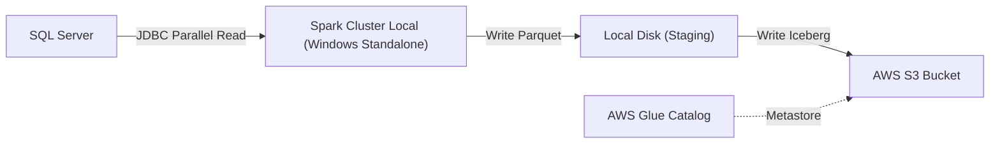

# Local Data Lakehouse: Spark (Windows), SQL Server & AWS Iceberg

Este projeto documenta e implementa um pipeline de dados distribuído (ETL) executado em um **cluster local Apache Spark (Standalone)** no Windows. O objetivo é demonstrar a extração paralela de alto desempenho do SQL Server e a carga em tabelas **Apache Iceberg** no Amazon S3, catalogadas via AWS Glue.


Este repositório contém todos os binários necessários (`winutils`, `.dll`) para facilitar a configuração em ambiente Windows.

## 🏗 Arquitetura

O fluxo de dados segue a arquitetura abaixo:



## 📋 Pré-requisitos e Dependências

Para reproduzir este laboratório, seu ambiente deve atender estritamente às seguintes versões para evitar incompatibilidades conhecidas:

1. **Sistema Operacional:** Windows 10 ou 11.
2. **Java:** JDK 8 ou 11 (Recomendado JDK 11 para Spark 3.5).
3. **Python:** **Versão 3.11** (Obrigatório).
> ⚠️ **Atenção:** Não utilize Python 3.12 ou superior. Existe um bug conhecido de incompatibilidade com o Apache Spark 3.5 que causa *crashes* silenciosos (SegFaults) durante a execução dos executors.


4. **Apache Spark:** Versão 3.5.7.

## ⚙️ Instalação e Configuração

Este repositório já inclui dependências críticas para o funcionamento do Hadoop no Windows e autenticação do SQL Server.

### 1. Configurar Hadoop (Winutils)

O Spark no Windows precisa de binários nativos do Hadoop para operações de I/O.

1. Localize a pasta `hadoop` neste repositório.
2. Copie a pasta para um local fixo, ex: `C:\hadoop`.
3. Defina a variável de ambiente:
* `HADOOP_HOME = C:\hadoop`


4. Adicione ao **PATH** do Windows: `%HADOOP_HOME%\bin`.

### 2. Configurar Autenticação SQL Server

Para usar `integratedSecurity=true` (Autenticação do Windows) via JDBC:

1. Localize o arquivo `mssql-jdbc_auth.dll` na pasta `libs` ou `hadoop/bin` deste repositório.
2. Copie este arquivo para `C:\Windows\System32` **OU** certifique-se de que a pasta onde ele está esteja no seu **PATH**.

### 3. Configurar Apache Spark

1. Baixe e extraia o Apache Spark 3.5.7.
2. Defina `SPARK_HOME` apontando para a pasta extraída.
3. Adicione `%SPARK_HOME%\bin` ao **PATH**.

### 4. Configuração do `spark-defaults.conf`

Navegue até `%SPARK_HOME%\conf`, renomeie `spark-defaults.conf.template` para `spark-defaults.conf` e substitua o conteúdo pelo abaixo.

**Destaques da Configuração:**

* **Integração Iceberg/AWS:** Os pacotes (`spark.jars.packages`) baixam automaticamente as dependências do Iceberg, AWS SDK e conector MSSQL.
* **Otimização Local:** Uso de `KryoSerializer` e ajuste de memória para rodar em desktop.
* **Monitoramento:** Logs de eventos ativados para o Spark History Server.

```properties
# --- Performance e Serialização ---
spark.serializer                     org.apache.spark.serializer.KryoSerializer
spark.kryoserializer.buffer.max      512m
spark.sql.adaptive.enabled           true
spark.sql.adaptive.coalescePartitions.enabled true
spark.sql.shuffle.partitions         500

# --- Recursos do Cluster (Ajuste conforme sua RAM) ---
spark.executor.instances             2
spark.executor.cores                 4
spark.executor.memory                5g
spark.driver.memory                  2g
spark.memory.fraction                0.8

# --- Rede e Master Local ---
spark.master                         spark://192.168.59.62:7077
spark.master.port                    7077
spark.master.webui.port              8080
spark.worker.ui.port                 8081
spark.driver.host                    192.168.59.62
spark.driver.bindAddress             0.0.0.0
spark.network.timeout                800s
spark.executor.heartbeatInterval     60s

# --- Pacotes (Iceberg, AWS, Hadoop, MSSQL) ---
# O Spark baixará estes JARs automaticamente na primeira execução
spark.jars.packages                  org.apache.iceberg:iceberg-spark-runtime-3.5_2.12:1.10.0,org.apache.iceberg:iceberg-aws-bundle:1.10.0,org.apache.hadoop:hadoop-aws:3.3.4,org.apache.hadoop:hadoop-common:3.3.4,com.amazonaws:aws-java-sdk-bundle:1.12.764,com.microsoft.sqlserver:mssql-jdbc:13.2.1.jre11

# --- Configuração do Catálogo Iceberg (AWS Glue) ---
spark.sql.defaultCatalog             dev
spark.sql.catalog.dev                org.apache.iceberg.spark.SparkCatalog
spark.sql.catalog.dev.type           glue
spark.sql.catalog.dev.warehouse      s3://data-warehouse/tables/
spark.sql.catalog.dev.io-impl        org.apache.iceberg.aws.s3.S3FileIO
spark.sql.catalog.dev.s3.cross-region-access-enabled true
spark.sql.catalog.dev.glue.skip-name-validation      true
spark.sql.extensions                 org.apache.iceberg.spark.extensions.IcebergSparkSessionExtensions

# --- Otimização S3 ---
spark.hadoop.fs.s3.impl              org.apache.hadoop.fs.s3a.S3AFileSystem
spark.hadoop.fs.s3a.impl             org.apache.hadoop.fs.s3a.S3AFileSystem
spark.hadoop.fs.s3a.fast.upload      true
spark.hadoop.fs.s3a.multipart.size   100M
spark.sql.parquet.int96RebaseModeInWrite CORRECTED

# --- Logs e History Server ---
spark.eventLog.enabled               true
spark.eventLog.dir                   file:///C:/spark/spark-3.5.7-bin-hadoop3/spark-events
spark.history.fs.logDirectory        file:///C:/spark/spark-3.5.7-bin-hadoop3/spark-events
spark.history.ui.port                18080

```

---

## 🚀 Execução do Pipeline

### 1. Iniciar o Cluster

Abra o terminal (Powershell ou CMD) e inicie o Master e o Worker:

```powershell
# Iniciar Master
spark-class org.apache.spark.deploy.master.Master

# Em outro terminal, Iniciar Worker (aponte para o IP do seu master)
spark-class org.apache.spark.deploy.worker.Worker spark://192.168.59.62:7077

```

### 2. Iniciar o History Server (Opcional, para monitoramento)

```powershell
spark-class org.apache.spark.deploy.history.HistoryServer

```

Acesse `http://localhost:18080` para ver os logs de execução.

### 3. Executar o Job Python

Certifique-se de que suas credenciais AWS estão configuradas (variáveis de ambiente ou `~/.aws/credentials`).

```bash
python main_pipeline.py

```

---

## 🐍 Explicação do Código (`main_pipeline.py`)

O script Python é modularizado para garantir robustez e performance. Abaixo, a explicação detalhada de cada componente.

### 1. Classes de Dados (`SparkTable` e `URLMssql`)

Utilizamos `dataclasses` para evitar "hardcoding" de strings e facilitar a manutenção.

* **`SparkTable`**: Define a estrutura da tabela (servidor, banco, schema, chaves). Gera automaticamente os nomes qualificados para SQL Server e AWS Athena/Glue.
* **`URLMssql`**: Constrói a string de conexão JDBC complexa, injetando configurações de segurança (`integratedSecurity=true`) e performance.

### 2. Tratamento Dinâmico de Datas (`parse_date_expressions`)

Permite usar placeholders na string de condição, facilitando agendamentos (Airflow/Cron) sem alterar o código.

* **Funcionalidade:** Substitui termos como `{hoje}`, `{ontem}`, `{inicio_mes}` e operações aritméticas (ex: `{hoje-3d}`) pelas datas reais no momento da execução.

### 3. Paralelismo Inteligente (`lower_upper_bound` e `iter_lower_upper_bound`)

O gargalo do JDBC é ler tudo em uma única thread. Estas funções resolvem isso:

* **`lower_upper_bound`**: Consulta o `MIN` e `MAX` da chave primária (PK) na origem. Esses valores alimentam as opções `lowerBound` e `upperBound` do Spark JDBC, permitindo que o Spark divida a leitura em N partições simultâneas (definido por `numPartitions`).
* **`iter_lower_upper_bound`**: Para tabelas muito grandes, quebra a leitura em "lotes" (chunks) lógicos, evitando sobrecarregar a memória do driver ou do banco de dados.

### 4. Extração e Staging (`write_parquet`)

* Lê do SQL Server usando as partições calculadas.
* Normaliza colunas para minúsculo (boa prática para Data Lakes).
* Escreve em disco local (`LOCAL_FILES`) em formato **Parquet** com compressão **ZSTD**. Isso serve como uma área de *staging* segura antes do upload para nuvem.

### 5. Carga no Data Lake (`overwrite_table_iceberg`)

* Lê os arquivos Parquet locais.
* Escreve na tabela Iceberg no S3 (`glue.db.table`).
* **Propriedades Críticas:**
* `write.format.default`: Parquet.
* `write.merge.mode`: **merge-on-read** (Ideal para atualizações frequentes, grava deltas rapidamente).
* `write.target-file-size-bytes`: 128MB (Otimizado para leitura de engines como Trino/Athena).


### 6. Manutenção Automática (`optimize_table`)

O Iceberg requer manutenção para não degradar a performance (problema de "small files"). O script executa automaticamente ao final:

1. **`rewrite_data_files`**: Compacta arquivos pequenos em arquivos maiores (bin-packing).
2. **`expire_snapshots`**: Remove versões antigas da tabela (time travel) para economizar espaço no S3.
3. **`remove_orphan_files`**: Limpa arquivos que não estão mais referenciados em nenhum snapshot.

---

## 📄 Código Completo

```python
from datetime import datetime, timedelta
from dataclasses import dataclass
import uuid
import re
import shutil
from pyspark.sql import SparkSession

LOCAL_FILES = "M:/lake_house"

@dataclass
class SparkTable:
    server: str
    database: str
    schema_table: str
    table_name: str
    primary_key: str
    conds: str = None

    @property
    def full_name(self) -> str:
        return f"{self.database}.{self.schema_table}.{self.table_name}"

    @property
    def full_name_athena(self) -> str:
        return f"{self.database.lower()}_{self.schema_table.lower()}_{self.table_name.lower()}"

@dataclass
class URLMssql:
    table: SparkTable
    driver: str = "com.microsoft.sqlserver.jdbc.SQLServerDriver"
    isolation_level: str = "READ_UNCOMMITTED"
    prefer_timestamp_ntz: bool = True

    @property
    def full_url(self) -> str:
        return (
            f"jdbc:sqlserver://{self.table.server}:1433;"
            f"databaseName={self.table.database};"
            "encrypt=true;integratedSecurity=true;trustServerCertificate=true;"
        )

    @property
    def options(self) -> dict[str, str]:
        return {
            "url": self.full_url,
            "driver": self.driver,
            "isolationLevel": self.isolation_level,
            "preferTimestampNTZ": self.prefer_timestamp_ntz,
        }

def parse_date_expressions(query_string: str | None) -> str | None:
    if not query_string:
        return query_string

    hoje = datetime.now()
    bases = {
        "hoje": hoje,
        "ontem": hoje - timedelta(days=1),
        "inicio_mes": hoje.replace(day=1),
        "inicio_ano": hoje.replace(month=1, day=1),
    }

    def replace_match(match: re.Match):
        base_name = match.group(1)
        operator = match.group(2)
        amount = match.group(3)

        target_date = bases.get(base_name)
        if not target_date:
            return match.group(0)

        if not operator:
            return target_date.strftime("%Y-%m-%d")

        days = int(amount)
        if operator == "-":
            new_date = target_date - timedelta(days=days)
        elif operator == "+":
            new_date = target_date + timedelta(days=days)

        return new_date.strftime("%Y-%m-%d")

    pattern = r"\{(hoje|ontem|inicio_mes|inicio_ano)(?:([\+\-])(\d+)d)?\}"
    return re.sub(pattern, replace_match, query_string)

def lower_upper_bound(spark: SparkSession, table: SparkTable) -> tuple:
    url = URLMssql(table)
    stmt = f"""
    select 
        min({table.primary_key}) as min_lower, 
        max({table.primary_key}) as max_upper
    from {table.full_name} with(nolock)
    {f"where {table.conds}" if table.conds else ""}
    """
    options = url.options
    options |= {"query": stmt}
    start, end = spark.read.format("jdbc").options(**options).load().collect()[0]
    return start, end

def write_parquet(spark: SparkSession, table: SparkTable, cores: int = 8) -> str:
    start, end = lower_upper_bound(spark, table)
    url = URLMssql(table)

    if isinstance(start, datetime):
        start, end = f"{start:%Y-%m-%d %H:%M:%S}", f"{end:%Y-%m-%d %H:%M:%S}"

    options = url.options
    options |= {
        "dbtable": f"(select * from {table.full_name} with(nolock) {f'where {table.conds}' if table.conds else ''}) as tabela",
        "partitionColumn": table.primary_key,
        "numPartitions": cores,
        "fetchsize": 100_000,
        "lowerBound": f"{start}",
        "upperBound": f"{end}",
    }

    df = spark.read.format("jdbc").options(**options).load()
    rename_cols = {c: c.lower() for c in df.columns}

    df.withColumnsRenamed(rename_cols).write.parquet(
        f"{LOCAL_FILES}/{table.full_name_athena}/{table.full_name_athena}_{uuid.uuid4()}",
        compression="zstd",
        mode="overwrite",
    )
    return table

def overwrite_table_iceberg(spark: SparkSession, table: SparkTable, schema: str = "spark_load") -> SparkTable:
    df = spark.read.parquet(f"{LOCAL_FILES}/{table.full_name_athena}/{table.full_name_athena}_*")
    (
        df.coalesce(24)
        .writeTo(f"{schema}.{table.full_name_athena}")
        .tableProperty("write.format.default", "parquet")
        .tableProperty("write.parquet.compression-codec", "zstd")
        .tableProperty("write.parquet.compression-level", "3")
        .tableProperty("write.distribution-mode", "none")
        .tableProperty("write.object-storage.enabled", "true")
        .tableProperty("write.target-file-size-bytes", "134217728")
        .tableProperty("write.delete.mode", "merge-on-read")
        .tableProperty("write.update.mode", "merge-on-read")
        .tableProperty("write.merge.mode", "merge-on-read")
        .createOrReplace()
    )
    return table

def optimize_table(spark: SparkSession, table: SparkTable, schema: str = "spark_load") -> SparkTable:
    print(" => rewrite_data_files")
    table_name = f"{schema}.{table.full_name_athena}"
    spark.sql(f"""
        CALL system.rewrite_data_files(
            table => '{table_name}',
            options => map('partial-progress.enabled', 'true', 'rewrite-all', 'true')
        )
    """)
    
    print(" => expire_snapshots")
    dt_expire = datetime.now() - timedelta(minutes=1)
    spark.sql(f"""
        CALL system.expire_snapshots(
            table => '{table_name}',
            older_than => TIMESTAMP '{dt_expire:%Y-%m-%d %H:%M:%S}',
            retain_last => 1
        )
    """)
    
    print(" => remove_orphan_files")
    spark.sql(f"""
        CALL system.remove_orphan_files(
            table => '{table_name}',
            dry_run => false
        )
    """)
    return table

def iter_lower_upper_bound(spark: SparkSession, table: SparkTable, chunk: int = 100) -> list[tuple]:
    url = URLMssql(table)
    stmt = f"""
    select distinct {table.primary_key} as chave
    from {table.full_name} with(nolock)
    {f"where {table.conds}" if table.conds else ""}
    """
    options = url.options
    options |= {"query": stmt}
    rows = spark.read.format("jdbc").options(**options).load().collect()
    rows_sorted = sorted([row.chave for row in rows])
    lista_batch = []
    for idx in range(0, len(rows_sorted), chunk):
        lotes = rows_sorted[idx : idx + chunk]
        lista_batch.append((lotes[0], lotes[-1]))
    return lista_batch

def main_spark_jdbc(
    server: str,
    database: str,
    schema_table: str,
    table_name: str,
    primary_key: str,
    conds: str | None = None,
    chunk: int = 100,
    cores: int = 8,
    optimize: bool = False,
    iter_lower: bool = True,
    create_table: bool = True,
    drop_table: bool = False,
) -> None:
    try:
        spark: SparkSession = SparkSession.builder.appName("job_jdbc").getOrCreate()
        conds = parse_date_expressions(conds)
        tbl = SparkTable(server, database, schema_table, table_name, primary_key, conds)

        if iter_lower:
            rows = iter_lower_upper_bound(spark, tbl, chunk=chunk)
            where = f"and ({conds})" if conds else ""
            for start, end in rows:
                tbl.conds = f"{tbl.primary_key} between {start} and {end} {where}"
                print(tbl.conds)
                print("1 - WRITE PARQUET")
                write_parquet(spark, tbl, cores)
        else:
            write_parquet(spark, tbl, cores)

        if create_table:
            print("2 - OVERWRITE TABLE ICEBERG")
            overwrite_table_iceberg(spark, tbl)

        if optimize and not drop_table:
            print("5 - OPTIMIZE TABLE")
            optimize_table(spark, tbl)
    except Exception as e:
        print(e)
        raise
    finally:
        shutil.rmtree(f"{LOCAL_FILES}/{tbl.full_name_athena}", ignore_errors=True)
        spark.stop()

```